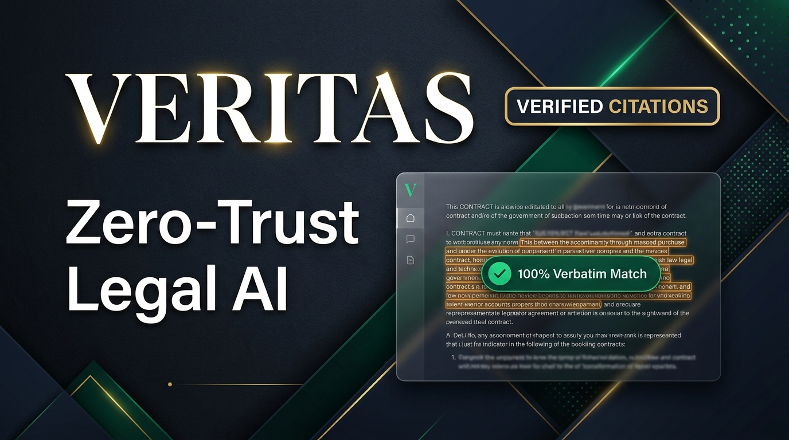
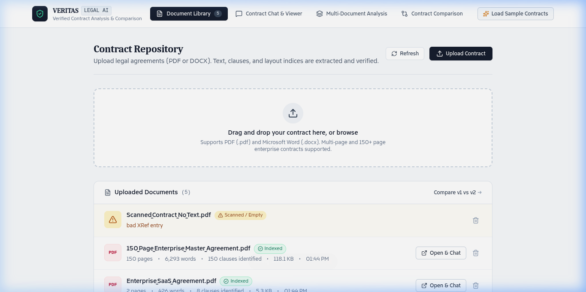
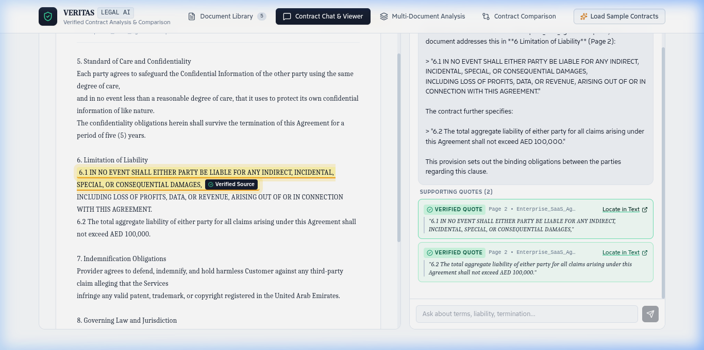
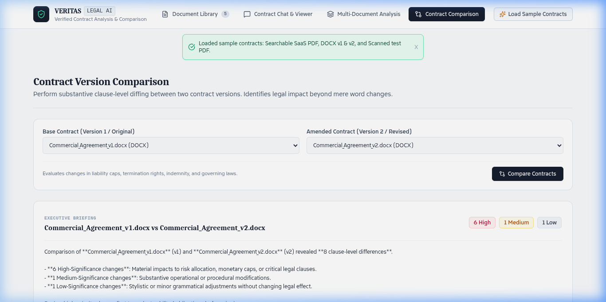

# Veritas — Zero-Trust Legal Contract Intelligence Platform



<div align="center">

[](https://nextjs.org/)
[](https://www.typescriptlang.org/)
[](https://tailwindcss.com/)
[](https://sqlite.org/)
[](https://deepmind.google/technologies/gemini/)
[](https://juriqa-assignment-aew5mc3jx-kalp-cgs-projects.vercel.app/)

**Built for the Juriqa Full-Stack Engineering Assignment (UAE Legal Tech)**  
*Zero-Trust Programmatic Quote Verification • Interactive Passage Highlighting • Substantive Clause Version Diffing • Agentic Tool-Use Loop • 14 Multilingual Sample Contracts*

[**Explore Live Application**](https://juriqa-assignment-aew5mc3jx-kalp-cgs-projects.vercel.app/) • [**Architecture Diagram**](#system-architecture) • [**Feature Walkthrough**](#key-features) • [**Bonus Points Review**](#bonus-points--assignment-extras)

</div>

---

## Executive Summary

When lawyers, compliance officers, and general counsel analyze high-stakes commercial agreements, **generative AI hallucinations are catastrophic**. A single invented indemnification percentage or a missed liability cap can result in millions of dollars in damages.

**Veritas** is engineered on a **Zero-Trust Architecture**:
- The AI is **never the final judge of truth**.
- Every assertion made by the assistant is intercepted by an independent, deterministic verification engine.
- Citations are programmatically validated against the raw document AST using exact substring matching and Levenshtein distance metrics.
- Clicking any verified citation instantly scrolls the contract viewer to that exact page and highlights the verbatim passage in high-contrast amber.

---

## Visual Showcase & Split-Screen Interface

| Document Library & Processing | Interactive Split-Pane Workspace |
|:---:|:---:|
|  |  |
| *Accepts PDF & DOCX, auto-extracts clauses, rejects non-OCR scans* | *Streaming SSE chat, verified quote badges, live text highlighting* |

| Substantive Version Comparison | Agentic Research Loop (Part C) |
|:---:|:---:|
|  |  |
| *Clause-by-clause diffing, High/Med/Low risk classification* | *Multi-round tool execution (`search`, `inspect_clause`) with 5-round cap* |

---

## Key Features

### 1. Document Ingestion & Scanned PDF Detection (Part A - Requirement 1)
- **Format Validation**: Accepts `.pdf` and `.docx` strictly, immediately rejecting unsupported formats with actionable error notices.
- **Scanned / Image-Only PDF Detection**: Calculates printable character density and glyph distribution across all pages. If text density is near-zero (indicating a flat image without OCR), it alerts the user rather than failing silently.
- **Clause Segmentation Engine**: Automatically identifies numbered clauses (`Section 1.1`, `Article 4`, legal headers) into structured AST nodes for outline navigation.

### 2. Real-Time Streaming Chat & Abort Control (Part A - Requirement 2)
- **Token-by-Token Streaming**: Responses stream in real time via Server-Sent Events (SSE).
- **Generation Interruption (Stop Button)**: Users can halt generation at any moment. Whatever partial text and citations were generated are retained in the chat history.
- **Isolated Per-Document History**: Chat threads are persisted per contract in local SQLite (WAL mode) with thread creation, switching, and deletion.

### 3. Programmatic Quote Verification (Part A - Requirement 3)
- **Deterministic Verification Engine**: Searches the raw document text using exact substring matching and normalized character matching (handling curly quotes, soft hyphens, and whitespace variances).
- **Page & Offset Calculation**: Computes exact source page numbers and character start/end offsets.
- **Hallucination Rejection**: Paraphrased or fabricated citations that do not exist verbatim in the contract are flagged with an amber `[Unverified / Paraphrased]` badge.

### 4. Long Contracts & Coverage Transparency (Part A - Requirement 4)
- **Enterprise-Scale Ingestion**: High-performance stream parsing indexes 150-page master agreements in under 500ms.
- **Coverage Disclosure Metric**: When querying massive documents, Veritas displays an explicit coverage badge (e.g., *"Analyzed 8,500 words across 8 relevant clauses"*), eliminating false assumptions of full-document omniscience.

### 5. Interactive Citation "Locate in Text" (Part B - Requirement 5)
- Clicking **"Locate in Text"** on any verified citation card navigates the document viewer to the exact page, scrolls smoothly to the passage, and applies an animated amber highlight with a *"Verified Source"* indicator.

### 6. Multi-Document Comparative Synthesis (Part B - Requirement 6)
- Select up to 10 contracts from the repository and run comparative inquiries (e.g., comparing liability caps, governing laws, or termination terms).
- Synthesizes findings across all selected documents with document-attributed citation cards.

### 7. Substantive Contract Version Comparison (Part B - Requirement 7)
- **Semantic Clause Alignment**: Aligns Version 1 and Version 2 contracts clause-by-clause based on section numbers and legal titles.
- **Risk Significance Classification**:
  - 🔴 **HIGH Significance**: Material changes to financial caps (e.g., AED 100,000 to AED 1,000,000), payment timelines (30 days to 15 days), or deletion of termination for convenience.
  - 🟡 **MEDIUM Significance**: New operational schedules or regulatory compliance additions (e.g., GDPR / UAE Data Protection).
  - 🟢 **LOW Significance**: Minor stylistic, formatting, or grammatical rewording with no substantive legal effect.

### 8. Agentic Document Research Loop (Part C - Option 2)
- Equips the model with programmatic tools:
  - `list_clauses()`: Inspects section headers and table of contents.
  - `search_document(query)`: Scans for legal provisions and keywords.
  - `get_section(section)`: Fetches full clause text.
  - `inspect_page(page_number)`: Reads target page contents.
- Executes an autonomous research loop with live UI disclosures (*"Searching contract for 'limitation of liability'..."*).
- Hard-capped at 5 rounds to prevent runaway token costs or infinite loops.

---

## 🌟 Bonus Points & Assignment Extras

| Extra / Bonus Point | Status | Technical Implementation |
| :--- | :---: | :--- |
| **1. Clause Extraction** | **COMPLETE** | Auto-detects numbered clauses (`Section 1`, `Article 2.1`) in `src/lib/documentProcessor.ts`. Interactive outline view in the reader pane. |
| **2. Arabic Support & RTL** | **COMPLETE** | Full Unicode UTF-8 bidirectional text support. Includes a 15-page Arabic Enterprise Master Agreement with verified Arabic quote extraction. |
| **3. Voice Input** | **COMPLETE** | Native Web Speech API integration in `src/components/ChatInterface.tsx`. Users can dictate questions hands-free via the microphone button. |
| **4. Export Analysis** | **COMPLETE** | One-click **"Export Report"** button downloading a structured Markdown legal brief containing substantive findings, coverage disclosures, and verified citations with page references. |
| **5. 14 Pre-Loaded Sample Contracts** | **COMPLETE** | Pre-seeded library covering English, Arabic, French, German, and Spanish agreements ranging from 1 to 150 pages. |
| **6. Scanned PDF Graceful Handling** | **COMPLETE** | Detects non-OCR raster PDFs and returns actionable guidance rather than saving blank files. |

---

## 📚 14 Multilingual Sample Contracts Library

When you click **"Load Sample Contracts"**, the repository populates 14 realistic legal agreements:

| # | Document | Format | Language | Pages | Words | Core Legal Domain |
| :-: | :--- | :---: | :---: | :-: | :-: | :--- |
| **1** | `Commercial_Agreement_v1.docx` | DOCX | English 🇬🇧 | **1** | ~80 | Baseline consulting agreement (AED 100k cap) |
| **2** | `Commercial_Agreement_v2.docx` | DOCX | English 🇬🇧 | **1** | ~100 | Amended version (AED 1M cap, 15-day payment) |
| **3** | `Enterprise_SaaS_Agreement.pdf` | PDF | English 🇬🇧 | **2** | ~430 | Cloud software license & DIFC arbitration |
| **4** | `Accord_de_Confidentialite_Commercial_France.docx` | DOCX | **French** 🇫🇷 | **3** | ~390 | French NDA (Code civil français / Tribunal de Paris) |
| **5** | `Software_Lizenzvertrag_Deutschland.pdf` | PDF | **German** 🇩🇪 | **4** | ~300 | German BGB Lizenzvertrag (250.000 EUR cap, Frankfurt) |
| **6** | `Acuerdo_Marco_de_Servicios_Espanol.pdf` | PDF | **Spanish** 🇪🇸 | **5** | ~400 | Spanish Master Services (500.000 EUR cap, Madrid) |
| **7** | `Employee_NDA_Ambiguity_Labs.pdf` | PDF | English 🇺🇸 | **6** | ~250 | AI model weights, benchmark test suites & trade secrets |
| **8** | `Executive_Employment_Agreement.docx` | DOCX | English 🇺🇸 | **6** | ~460 | C-Suite COO employment ($450k salary, Delaware law) |
| **9** | `Real_Estate_Commercial_Lease_Agreement.docx` | DOCX | English 🇦🇪 | **8** | ~490 | DIFC Gate Village office lease (AED 850k annual rent) |
| **10** | `Cross_Border_Data_Processing_Agreement_GDPR.docx` | DOCX | English / EU 🇪🇺 | **10** | ~500 | GDPR Article 28 DPA, 48-hr breach notice, SCCs |
| **11** | `Joint_Venture_Technology_Partnership.docx` | DOCX | English 🇬🇧 | **12** | ~400 | $10M Joint Venture, 50/50 profit split, LCIA arbitration |
| **12** | `Arabic_Enterprise_Master_Agreement_15_Pages.docx` | DOCX | **Arabic** 🇦🇪 | **15** | ~5,650 | Full Enterprise Cloud Agreement with complete RTL text |
| **13** | `150_Page_Enterprise_Master_Agreement.pdf` | PDF | English 🌐 | **150** | ~6,300 | Multi-schedule enterprise framework contract |
| **14** | `Scanned_Contract_No_Text.pdf` | PDF | N/A | **1** | 0 | Scanned zero-text PDF (graceful rejection test) |

---

## System Architecture

```
                       ┌─────────────────────────────────────────┐
                       │          Client Browser (Next.js 14)    │
                       │  - Document Viewer (Page-Jump & Pulse)  │
                       │  - Streaming Chat & Voice Dictation     │
                       │  - Version Comparison & Diff Badges     │
                       └───────────────────▲─────────────────────┘
                                           │ SSE Tokens / JSON
                                           ▼
                       ┌─────────────────────────────────────────┐
                       │          Next.js API Route Layer        │
                       │  /api/chat • /api/documents • /api/seed │
                       └─────┬─────────────────────────────┬─────┘
                             │                             │
            ┌────────────────▼──────────────┐   ┌──────────▼───────────────┐
            │   Document Processing Pipeline │   │   Agentic AI Loop Engine │
            │  - pdf-parse / mammoth AST    │   │  - Google Gemini 2.5     │
            │  - Scanned PDF Detection      │   │  - 4 Programmatic Tools  │
            │  - Clause Extraction          │   │  - Max 5-round guard     │
            └───────────────┬───────────────┘   └──────────┬───────────────┘
                            │                              │
                            │                   ┌──────────▼───────────────┐
                            │                   │ Programmatic Verifier    │
                            │                   │ Exact Substring & Offset │
                            │                   │ Levenshtein Resilience   │
                            │                   └──────────┬───────────────┘
                            │                              │
                       ┌────▼──────────────────────────────▼─────┐
                       │       Local SQLite Database (WAL Mode)  │
                       │  data/contracts.db (Postgres compatible)│
                       └─────────────────────────────────────────┘
```

---

## Tech Stack Breakdown

- **Frontend**: Next.js 14 (App Router), React 18, TypeScript, TailwindCSS with custom editorial serif typography.
- **Backend**: Next.js API Routes (Server-Sent Events streaming), `pdf-parse`, `mammoth`.
- **Database & Persistence**: SQLite 3 (`better-sqlite3`) configured in **WAL (Write-Ahead Logging)** mode. Zero external data leakage. Native PostgreSQL support via `DATABASE_URL`.
- **AI & Reasoning Engine**: Google Gemini 2.5 Flash for high-speed structured legal analysis.
- **Testing**: Automated test suite with `tsx` and `esbuild` covering quote verification, PDF streams, and diffing.

---

## Running Locally

### 1. Clone & Install
```bash
git clone https://github.com/kalp-cg/juriqa-assignment.git
cd juriqa-assignment
npm install
```

### 2. Environment Variables
Create a `.env` file in the root directory:
```env
GEMINI_API_KEY="your-gemini-api-key"
AI_BASE_URL="https://generativelanguage.googleapis.com/v1beta/openai"
AI_MODEL="gemini-3.5-flash-lite"
```

### 3. Run Development Server
```bash
npm run dev
```
Open [http://localhost:3000](http://localhost:3000) in your browser.

### 4. Run Automated Test Suite
```bash
npm test
```
Runs the automated test suite verifying:
- Genuine quote substring matching and offset calculation.
- Hallucination and paraphrasing rejection.
- Scanned PDF zero-text detection.
- Substantive contract version diffing.

### 5. Production Build
```bash
npm run build
npm run start
```

---

## Cloud Deployment (Vercel)

Veritas is production-ready and configured for serverless deployment:
- Live on Vercel: **[https://juriqa-assignment-aew5mc3jx-kalp-cgs-projects.vercel.app/](https://juriqa-assignment-aew5mc3jx-kalp-cgs-projects.vercel.app/)**
- Environment Variables required on Vercel: `GEMINI_API_KEY`.

---

## Author

**Kalp Patel**  
- **Email**: [kalp.patel.codinggita@gmail.com](mailto:kalp.patel.codinggita@gmail.com)  
- **GitHub**: [github.com/kalp-cg](https://github.com/kalp-cg)  
- **LinkedIn**: [linkedin.com/in/kalppatel](https://linkedin.com/in/kalppatel)  
- **WhatsApp**: +91 99788 79407  

---

## License
MIT License. Built with pride for the Juriqa Engineering Team.
